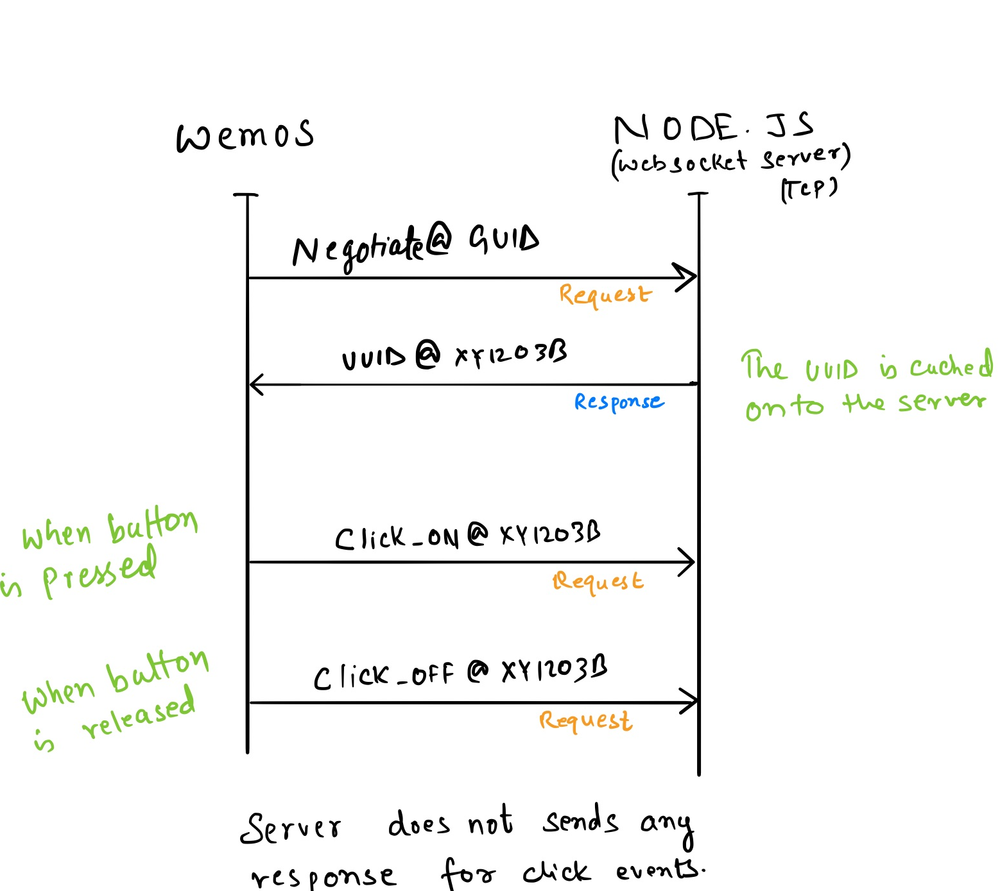
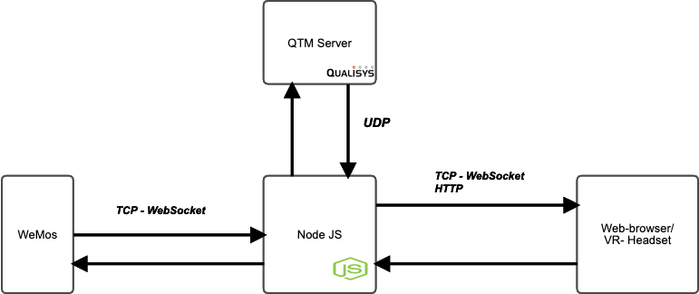

# Wemos
Websocket library: Decided to use the WebSocket library by Markus Sattler v2.1.1 The library is quite popular and well maintained. [Link](https://github.com/Links2004/arduinoWebSockets)

How wemos registers itself on the node server. We use the following protocol to register wemos on the server. 


## Protocol explained:
1. Register: As soon as the wemos device is powered on, it sends a NEGOTIATE request to register itself on the server. If the request is sent to a valid server address, the server replies with a UUID. The wemos stores this variable locally and uses this id to send further requests. The node js server caches the UUID, so even if the device is powered on/off it gets the same UUID every time. If the wemos device has not received a UUID from the server after booting it keeps on sending the Negotiate request to the server. 
2. Events: Whenever the D8 input pin is set on the wemos device the wemos device sends a click_on message with it’s UUID to the server. As soon as the button is released again a message with click_off is sent to the server. The server doesn’t reply to these message as the connection is TCP. 
3. Extention: The code is implemented to handle bi-directional communication. It is quite simple to extend this protocol to add various other messages. 

# Node js server
## Communication on the node js server:
The node js server exposes four ports (3 TCP and 1 UDP) when it gets started. These ports serve different purposes as explained below. 
1. TCP port to listen to Wemos messages(Over WebSocket).
2. UDP port to listen to QTM-RT OSC messages.
3. HTTP over TCP to serve web HTTP requests.
4. TCP port to stream Wemos and QTM-RT OSC messages(Over WebSocket).


## Overall Architecture:
  

The node js server is the central piece of the server which manages all the communication between the connected devices(Wemos and VR headsets)  
 
The server starts on port 5000 and listens to all interfaces. `npm start` to start the server. As soon as the server starts it does a few tasks. We will list all the tasks here.  
1. We persist wemos_id and QTM_id mapping in the data directory. When the server starts it reads the files in which these mappings are stored and load them into the memory. We display all these mappings the settings page. (Do not confuse with two kinds of mappings, we made it as an architectural decision)  
2. The server starts a UDP server on port mentioned in the config file [Config](./config/ServerConfig.js) (qtm_listen_port:30004).
This port is used to receive the OSC messages when you start streaming.  
3. The server starts a WebSocket port to stream the messages received from the OSC server and wemos devices. The port defined in [Config](./config/ServerConfig.js) (aframe_stream_port:44523)  
4. The server starts a WebSocket port to send/receives messages from the wemos devices. The port defined in [Config](./config/ServerConfig.js) (wemos_stream_port:80)  

See [Server.js](./server.js) for details.  

Messages sent to connected VR devices:  
Currently, we send two types of messages, the messages sent from qtm has a 6deuler property set(As we currently only stream that), the messages send from wemos devices has the wemos property set.  
Example:  
```
{"address":"/qtm/6d_euler/my_brush","args":[{"type":"f","value":3340.053955078125},
{"type":"f","value":2429.1494140625},{"type":"f","value":636.8633422851562},{"type":"f","value":11.894165992736816},
{"type":"f","value":2.245436668395996},{"type":"f","value":33.33510208129883}],
"6deuler":true}
{"id":"u45yU5Kv","click":false,"qid":"/qtm/6d_euler/my_brush","wemos":true}
```  

# Extending and how to develop further  
The whole implementation is the architecture is designed to scale. It is really easy to develop a VR application on top of what we have the server-side. Here are some key points.  

## How to get other messages than 6d_euler from the QTM server.  
See the `startStream("StreamFrames AllFrames 6DEuler")` function call in the [Controller](./src/controller/controller.js). This function sends the above message to the qtm server. Here it says send me all components of tracked rigid bodies in 6dof. You can easily modify this function to take an array of commands. (don't forget to modify `osc-qtm.js` to send these to the server).  

## How to send commands other commands to the wemos devices (Like some feedback display some lights or anything else)
The wemos receives messages on WebSocket. Each received message by the wemos has to have a message type(Currently it is all string message with a delimiter, you can extend it support JSON payloads if you want.) See example in the [wemos-contoller](./src/controller/wemos-wss.js), the `parseMessage` function see `clientSocket.send("UUID@" + uuid)`, here we send a generated UUID to the wemos device on a NEGOTIATE request(delim @).
To extend create your own message type defined in a function and the WebSocket reference to send the message.  
Note: Don't forget to add those in wemos implementation.  

## How to add support get all these messages on your VR application.  
We have a very basic proof of concept implemented which uses all the features of the application. If you look at the [index](./a-frame/index.html), you'll see just two function calls(init and startListening). Init, as the name suggests, starts the WebSocket client. The startListening function takes a callback, this callback is called on each message received on the WebSocket. [Here](./src/a-frame/AFrame-Client.js) we an implementation called `main` which parses all the messages and create dynamic objects in the a-frame context. (Good knowledge of javascript is expected). You can write your own callbacks like `main` do the parsing to manipulate stuff or add further functionality in it.  


# References
https://qualisys.github.io/Real-Time-Protocol-Documentation/  
https://aframe.io/docs/1.0.0/introduction/  